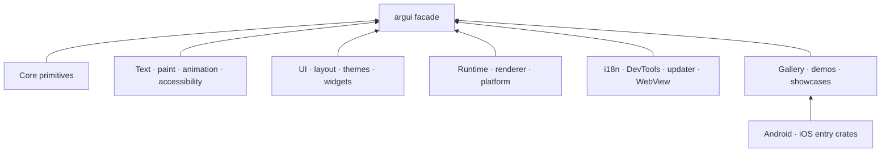

# Workspace crates and dependencies

Argui separates reusable engine layers, optional integrations and applications.
Every public crate shares one workspace version. Applications can depend on the
`argui` facade, while lower-level integrations can depend directly on the crate
that owns the API they need.

## Platform selection

| Target | Cargo feature | Entry point | CI verification |
| --- | --- | --- | --- |
| Linux | none | `argui::runtime::run_application` | Full tests, Clippy, coverage and archive builds on Ubuntu |
| Windows | none | `argui::runtime::run_application` | Complete workspace compile on Windows |
| macOS | none | `argui::runtime::run_application` | Complete workspace compile on macOS |
| WebAssembly | none | A `cdylib` with `#[wasm_bindgen(start)]` | Complete WASM compile and browser gallery build |
| Android | `argui-android` dependency | `argui_android::android_main!` | Feature cross-check plus Widget Gallery APK/AAB build |
| iOS | `argui-ios` dependency | `argui_ios::ios_main!` | Feature cross-check plus XCFramework/Simulator app build |

Cargo selects Linux, Windows, macOS and browser implementations through target
specific dependencies in `argui-platform`, `argui-runtime` and the integration
crates. They share Winit lifecycle code, so an extra facade for each desktop OS
would contain only re-exports. Android and iOS have dedicated crates because
their native shells require distinct ABI entry points and lifecycle setup.

The mobile entry crates are explicit dependencies, so `argui --all-features`
does not select Android or iOS and carries no mobile-only dependencies. Feature
flags on the main facade select capabilities such as Fluent localization,
widgets, tasks or desktop services; they do not replace Cargo target detection.
See the [mobile guide](../native-mobile.md) for APK/AAB and Xcode integration.
The reusable native shells live under `mobile/android` and `mobile/ios`; the
root scripts build them without moving shared application code out of the
Widget Gallery crate.

## Dependency layers



Arrows in this overview mean “is exposed through.” The table below gives the
actual direct internal dependency direction.

## Crate catalogue

“Public” means that the release workflow creates and verifies a crates.io
archive. Direct dependencies list production dependencies within this
workspace; external crates and development-only dependencies are omitted.

| Crate | Release | Purpose | Direct internal dependencies |
| --- | --- | --- | --- |
| `argui-core` | Public | Geometry, colors, identifiers and shared primitives | — |
| `argui-accessibility` | Public | Native and browser accessibility bridges | `argui-core` |
| `argui-animation` | Public | Animation timing and interpolation | `argui-core` |
| `argui-inspect` | Public | Renderer-independent inspection data | `argui-core` |
| `argui-paint` | Public | Renderer-independent paint commands and scene primitives | `argui-core` |
| `argui-image` | Public | Image decoding, caching and paint resources | `argui-paint` |
| `argui-platform` | Public | Winit input plus target-specific clipboard, picker, tray, popup and backdrop adapters | `argui-core`, `argui-paint` |
| `argui-text` | Public | Text shaping, layout, editing data and glyph preparation | `argui-core` |
| `argui-render` | Public | WGPU surface management and GPU rendering | `argui-core`, `argui-paint`, `argui-text` |
| `argui-theme` | Public | Theme tokens and appearance settings | `argui-core` |
| `argui-ui` | Public | Retained elements, styles, semantics and event dispatch | `argui-accessibility`, `argui-animation`, `argui-core`, `argui-paint`, `argui-text` |
| `argui-effects` | Public | Optional WGSL shaders and visual effects | `argui-paint`, `argui-render`, `argui-ui` |
| `argui-i18n` | Public | Optional Fluent bundles, locale negotiation and fallback | — |
| `argui-layout` | Public | Retained Flexbox and Grid layout | `argui-core`, `argui-paint`, `argui-text`, `argui-ui` |
| `argui-updater` | Public | UI-independent signed update transactions | — |
| `argui-vector` | Public | SVG parsing and vector paint resources | `argui-core`, `argui-paint` |
| `argui-webview` | Public | Optional retained native WebViews and browser frames | `argui-core`, `argui-layout`, `argui-ui` |
| `argui-runtime` | Public | Application lifecycle, retained model execution, windows and surfaces | `argui-accessibility`, `argui-animation`, `argui-core`, `argui-inspect`, `argui-layout`, `argui-paint`, `argui-platform`, `argui-render`, `argui-text`, `argui-theme`, `argui-ui`, optional `argui-webview` |
| `argui-android` | Public | Android `NativeActivity` bootstrap | `argui-platform`, `argui-render`, `argui-runtime`, `argui-text` |
| `argui-ios` | Public | iOS static-library and C ABI bootstrap | `argui-runtime` |
| `argui-widgets` | Public | Individually gated accessible widgets | `argui-animation`, `argui-core`, `argui-inspect`, `argui-paint`, `argui-platform`, `argui-runtime`, `argui-text`, `argui-theme`, `argui-ui`, optional `argui-updater`, `argui-vector` |
| `argui-devtools` | Public | Inspection, style editing, profiling and showcase UI | `argui-animation`, `argui-core`, `argui-effects`, `argui-inspect`, `argui-paint`, `argui-platform`, `argui-render`, `argui-runtime`, `argui-text`, `argui-theme`, `argui-ui`, `argui-vector`, `argui-widgets` |
| `argui` | Public | Stable application facade and feature routing | `argui-accessibility`, `argui-animation`, `argui-core`, `argui-layout`, `argui-paint`, `argui-platform`, `argui-render`, `argui-runtime`, `argui-text`, `argui-theme`, `argui-ui`, `argui-vector`; optional `argui-devtools`, `argui-i18n`, `argui-updater`, `argui-webview`, `argui-widgets` |
| `argui-showcase` | Private | Shared sample application used by native and web launchers | `argui-animation`, `argui-core`, `argui-image`, `argui-paint`, `argui-platform`, `argui-runtime`, `argui-text`, `argui-theme`, `argui-ui`, `argui-widgets` |
| `argui-widget-gallery` | Private | Interactive component, i18n, DevTools and mobile integration gallery | `argui`, `argui-android`, `argui-devtools`, `argui-effects`, `argui-image`, `argui-ios`, optional `argui-updater` |
| `argui-web-demo` | Private | WebAssembly launcher for the shared showcase | `argui`, `argui-devtools`, `argui-showcase` |
| `argui-state-app` | Private | Packaged native state and DevTools showcase | `argui`, `argui-devtools`, `argui-showcase` |
| `argui-perf-showcase` | Private | Native and WASM performance workloads | `argui` |

## Publication contract

`python3 scripts/release.py package` reads Cargo metadata, validates every
public manifest and calculates a topological order. It passes every public crate
to one `cargo package --all-features` invocation, allowing Cargo's temporary
registry to verify internal packages before the first public version exists.

The current order is:

```text
argui-core -> argui-accessibility -> argui-animation -> argui-i18n ->
argui-inspect -> argui-paint -> argui-image -> argui-platform -> argui-text ->
argui-render -> argui-theme -> argui-ui -> argui-effects -> argui-layout ->
argui-updater -> argui-vector -> argui-webview -> argui-runtime ->
argui-android -> argui-ios -> argui-widgets -> argui-devtools -> argui
```

The publication command uses the same dependency order and uploads `argui`
last. It runs only in protected CI when the version increases and the final
commit contains `[PUBLISH]`. Private applications never enter a crates.io
archive selection. A cycle, an unversioned internal dependency, an unpublished
production dependency or a facade dependent stops the release before upload.
